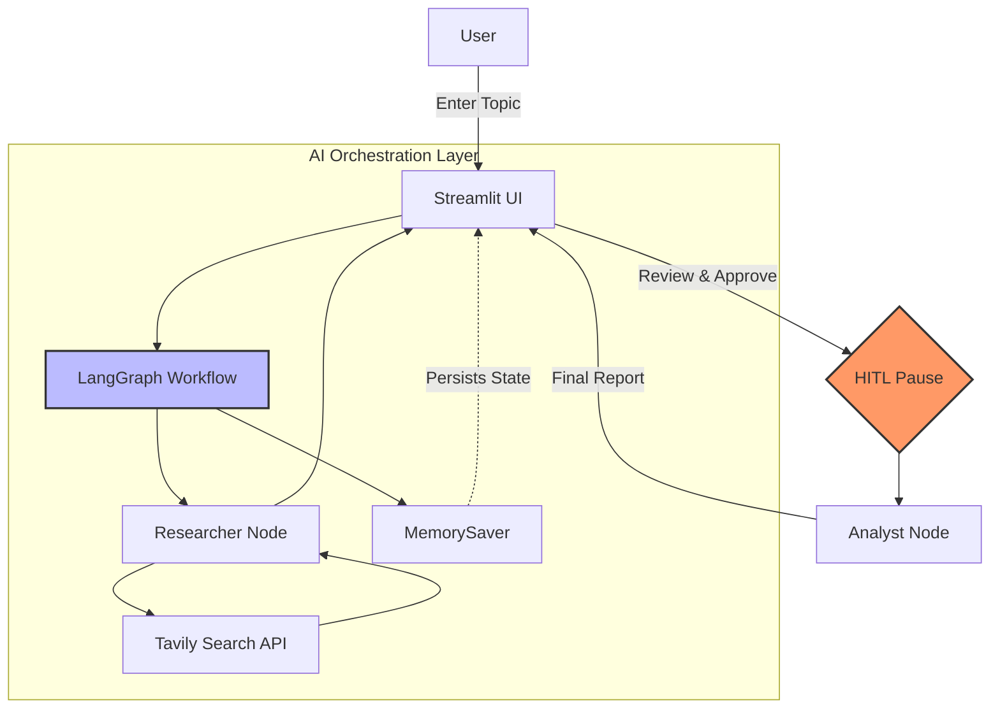

# Deep Market Intelligence Agent

An AI-powered market research application that performs web research and generates SWOT-style strategic recommendations. Built with **Streamlit**, **LangGraph**, **Groq**, and **Tavily**.

---

## Introduction

This project implements an agentic workflow for market research: you enter a topic (e.g., company or industry), the system searches the web via Tavily, and then produces a structured SWOT analysis and strategic recommendation using Groq (Llama 3.3). A **Human-in-the-Loop** step lets you review research results before approving the analysis, keeping control over cost and quality.

**Key features:**

- **Web search** — Uses Tavily for real-time information (avoids LLM knowledge cutoff)
- **Human-in-the-Loop** — Pauses after research for review; Approve or Clear before analysis
- **SWOT analysis** — Generates structured strategic output from approved research
- **Session state** — LangGraph checkpointer preserves conversation state

---

## Architecture

The workflow is modeled as a LangGraph DAG:



1. **Researcher** — Groq with Tavily tools runs searches and gathers sources
2. **Pause** — Displays research results; user chooses **Approve & Analyze** or **Clear Research**
3. **Analyst** — Groq synthesizes approved research into a SWOT analysis

---

## Tech Stack

| Layer         | Technology                    |
|---------------|-------------------------------|
| UI            | Streamlit                     |
| Orchestration | LangGraph                     |
| LLM           | Groq (Llama 3.3 70B)          |
| Search        | Tavily Search API             |
| Config        | python-dotenv                 |

---

## Prerequisites

- **Python 3.10+**
- **API keys:**
  - [Groq](https://console.groq.com/) — free tier available
  - [Tavily](https://app.tavily.com/) — free tier available

---

## Installation

### 1. Clone the repository

```bash
git clone https://github.com/nagac121/market-intel-agent.git
cd market-intel-agent
```

### 2. Create and activate a virtual environment

**Windows (PowerShell):**
```powershell
python -m venv .venv
.venv\Scripts\Activate.ps1
```

**macOS / Linux:**
```bash
python3 -m venv .venv
source .venv/bin/activate
```

### 3. Install dependencies

```bash
pip install -r requirements.txt
```

### 4. Configure environment variables

Copy the example env file and add your API keys:

```bash
copy .env.example .env
```

**Windows (PowerShell):**
```powershell
Copy-Item .env.example .env
```

**macOS / Linux:**
```bash
cp .env.example .env
```

Edit `.env` and set your keys:

```
GROQ_API_KEY=your_groq_api_key_here
TAVILY_API_KEY=your_tavily_api_key_here
```

---

## Run the application

```bash
python -m streamlit run main.py
```

The app opens in your browser at `http://localhost:8501`.

---

## Usage

1. Enter a research topic (e.g., "Apple Vision Pro 2026", "EV market trends")
2. Click **Start Research** — the agent searches the web and displays results
3. Review the research results, then click **Approve & Analyze** for a SWOT report, or **Clear Research** to reset
4. Use **Clear Research** anytime to return to a clean state

---

## Project Structure

```
market-intel-agent/
├── main.py          # Streamlit UI and orchestration
├── graph.py         # LangGraph workflow (researcher → analyst)
├── models.py        # Groq model and tools binding
├── tools.py         # Tavily search tool
├── .env.example     # Template for API keys
└── requirements.txt
```

---

## License

MIT
